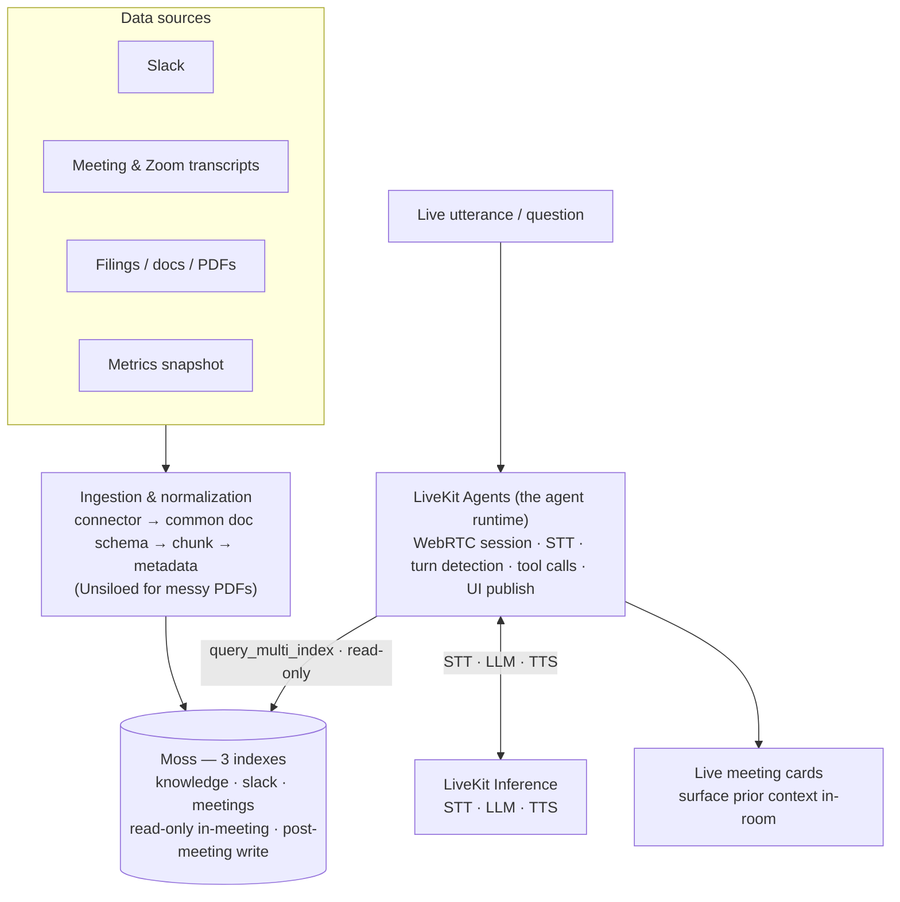

# PRD — tellmequick: Decision & Context Co-Pilot

*Real-time context surfacing for any meeting, call, or situation where the supporting facts already exist but aren't in the room. Domain-agnostic; v0 demo is a financial leadership meeting.*

**Status:** v0, hackathon scope (24h) · **Event:** Conversational AI Hackathon (YC / Moss), June 6–7 2026

---

## One-liner

A team's context — Slack threads, meeting transcripts, documents, metrics, prior decisions — is scattered across tools and human memory. **tellmequick** unifies all of it into one fast, queryable memory and surfaces the relevant prior context *live in the room* when it's needed. So "we talked about this somewhere" and "let me get back to you" stop being how high-stakes calls get made.

## Why now / the wedge

High-stakes meetings — finance reviews, exec syncs, customer escalations, hiring debates, strategy calls — happen without the context that should inform them. It was decided in a Slack thread three weeks ago, buried in last quarter's transcript, sitting in a doc nobody reread. The fact isn't in the room, so the decision slips or gets made on vibes.

Existing tools each own one slice and none close the loop live: meeting assistants (Granola, Gong) work *after* the call; enterprise search (Glean) is a separate tab you context-switch into. The wedge is unifying spoken/written history **and** documents into one memory, and retrieving from it fast enough to land *before the next sentence*.

---

## ⚠️ Scope: north-star vs. v0 (read this first)

The architecture below describes the **full vision**. The 24-hour build ships a deliberately small slice of it. Do not build the whole thing.

| | North-star (the vision / what we scaffold toward) | **v0 — what actually ships in 24h** |
|---|---|---|
| Sources | Slack, Zoom, live meeting audio, filings/PDFs, internal metrics, CRM | Live transcript (LiveKit Agents) + **Slack seeded** + a metrics snapshot + a couple of seed docs/filings |
| Ingestion | Live connectors, scheduled sync | **Seed-time ingest only** (scripted, pre-demo) |
| Surfaces | Live cards (+ dashboards later) | **Live cards only** |
| Memory | Multi-company, retention, privacy scoping | One company, one group thread |
| Decisions | Eventually opining on decisions ("should we lay off?", "should we honor this discount?") | **surface evidence, cited — humans decide** |

tellmequick is domain-agnostic; the v0 demo is the core surface pointed at a financial leadership scenario, with Slack as a second source. Everything else is connectors and surfaces the architecture is *designed for* but we don't build on the clock.

---

## Non-Goals (v0)

- **Speaking over the meeting.** The agent has voice (Cartesia TTS) but only chimes in when retrieving something useful; not narrating, not summarizing, not commenting on every utterance. Display surface always runs in parallel.
- **Visualizations / dashboards.** Deferred — not in v0. Metrics are retrievable as text (e.g. "enterprise churn Q2 = X"), but no charts.
- **Decision recommendations.** The tool surfaces evidence (prior decisions, what was said where, risks) with citations. Humans make the call. An AI making confident high-stakes calls is neither credible nor defensible.
- **Note-taking / summaries.** Crowded post-call market; we write decisions back to memory but don't generate minutes.
- **Live connectors, auth, multi-tenant.** Seed data only in 24h.
- **Mobile.**

---

## Architecture



### The key abstraction: one normalized document

Every source is a **connector** that emits the same shape. This is what makes new sources cheap and lets the agent scaffold uniformly.

```jsonc
{
  "id": "slack:C123:p1699...",        // stable, source-prefixed
  "text": "...",                       // the chunk to embed/search
  "source": "slack | transcript | filing | metric | doc",
  "group_id": "acme-strategy-weekly",  // the thread/topic scope
  "user_id": "priya | null",           // who said/owns it (for attribution)
  "timestamp": "2026-05-01T...",
  "url": "https://slack.com/...",      // permalink for the citation
  "is_decision": false,
  "meta": { /* source-specific extras */ }
}
```

- **Slack** → one doc per message (or per thread), thread-aware, `user_id` from author.
- **Transcripts** (LiveKit Agents live session + uploaded Zoom) → one doc per turn segment.
- **Documents / filings** → Unsiloed parses the PDF → chunked docs, `meta` carries doc type + section.
- **Metrics** → a KPI snapshot; a text summary row per metric goes into Moss for retrieval ("enterprise churn Q2 = X"). No time-series / charts in v0.

Retrieval is then uniform: `Moss.query_multi_index([knowledge, slack, meetings], query_text, QueryOptions(filter={group_id}))` hits **all** sources in one read-only round trip, scoped by metadata.

### Component responsibilities

| Component | Role |
|---|---|
| **Connectors** | One adapter per source → normalized docs. Pluggable; adding a source = adding a connector. |
| **Ingestion** | Chunk per source type, attach metadata, write to Moss. Unsiloed for messy PDFs. Seed-time in v0. |
| **Moss** | Memory + retrieval across **three indexes** — `knowledge` (filings/docs), `slack` (messages), `meetings` (distilled notes + decisions). **Built-in embedding (`moss-minilm`)** for both ingest and query — no embedding service, no embedding-space mismatch. **Hybrid** (semantic + keyword) via `alpha`. **Read-only during a live meeting:** the agent retrieves across all three in one `query_multi_index` call, `group_id`-scoped; nothing is written to Moss on the hot path. The `meetings` index is written once, post-meeting, by a distillation pass. Managed SaaS via `MossClient`. |
| **LiveKit Agents** | **The agent runtime.** A LiveKit Agents worker joins the meeting room over WebRTC as a programmatic participant, runs streaming STT + turn detection on the live audio, hosts the LLM + `@function_tool` loop, calls read-only retrieval (`search_context`) over Moss (no mid-meeting writes; persistence is a post-meeting pass), and publishes cards to the frontend over LiveKit data channels (`moss_context` messages). This is where "the agent" lives; **LiveKit Inference** is the model gateway it calls into. |
| **LiveKit Inference** | Managed STT (`deepgram/nova-3`), LLM (`openai/gpt-5.2-chat-latest`), and TTS (`cartesia/sonic-3`) behind the LiveKit Agents API — no separate gateway, no provider keys. The LLM decides when to call `search_context` (gating via system prompt, not a separate structured call); a follow-up completion synthesizes the spoken reply from the tool results. |
| **Live cards surface** | Frontend in the LiveKit room subscribes to the agent's data channel and renders the surfaced answer with source attribution + permalink. |

### The per-utterance loop (hot path, <1s)

Runs inside the LiveKit Agents session — STT events from the live audio track drive the loop; cards are published back over the LiveKit data channel.

```
LiveKit Agents STT turn → LLM turn (gpt-5.2 via Inference)
   → LLM decides to call search_context   (gating via system prompt, not a separate call)
   → search_context → Moss.query_multi_index([knowledge, slack, meetings], group_id)  // read-only, one round trip
   → agent publishes moss_context card to the data channel → on screen (<1s)
   → LLM continuation synthesizes the spoken reply (Cartesia TTS)

NO Moss writes during the meeting — turns + flagged decisions held in in-process working memory only.
post-meeting: distill working memory → meetings index (notes + decisions; raw transcripts NOT stored;
              within-meeting conflicts resolved → latest decision wins).
```

---

## Demo scenario (v0)

A finance leadership meeting reviewing whether to cut a budget line. Seeded context: a Slack thread where the team debated it three weeks ago (`slack`), a prior meeting's distilled decision (`meetings`), a parsed filing/contract (`knowledge`).

- **Hero moment:** someone says "didn't we go back and forth on this in Slack?" → the thread + the prior decision + owner appears on screen in <1s with a permalink → decision made live, no action item. Follow with the same query lagging on a networked vector DB.

---

## Requirements (v0)

### Must-Have (P0)

- **LiveKit Agents worker** running as a programmatic participant in the meeting room, driving live STT (single-stream, < ~2s caption lag, no speaker labels at P0), the per-utterance loop, and card publishing back to the room.
- **Multi-source seed:** filings/docs → `knowledge`, Slack export → `slack`, seed prior-meeting notes/decisions → `meetings`. Async ingest, pre-demo.
- **LLM tool-call gating** — the agent LLM decides when to retrieve via the `search_context` tool, driven by the system prompt (no separate structured gate call). Tuned conservative on the 15-question eval set so it fires on real context-references, not small talk.
- **Cross-source retrieval** — one `query_multi_index` call hits `knowledge` + `slack` + `meetings` together, `group_id`-scoped; read-only during the meeting; single-digit-ms on the seeded corpus.
- **Answer card** — structured records render via template (answer + source + permalink: "from Slack, [date]" / "Decided in [meeting]"); LLM synthesis only for unstructured chunks; end-to-end < 1s on the happy path.
- **Post-meeting memory** — at meeting end, a distillation pass writes important notes + decisions to the `meetings` index (raw transcripts not stored; within-meeting conflicts resolved to the latest decision). No writes to Moss during the meeting. Retrievable in the next meeting.
- **Retrieval-latency comparison** — Moss vs. a **networked** vector DB on the same query.

### Nice-to-Have (P1)

- Person-scoped attribution (from seeded `user_id`, not live diarization).
- Empty/low-confidence state ("no strong match" instead of bluffing).
- Live observability via LiveKit Agent Observability (built into the scaffold).
- A second live source wired (e.g., a real Slack connector instead of seed export).

### Future / P2 (north-star)

- Live connectors (Slack, Zoom, filings sync, CRM). **Dashboards / trend visualizations (deferred).** Cross-meeting reconciliation. Multi-company memory, retention, privacy scoping. Auth, multi-tenant, deploy.

---

## Repo layout (actual — built on `moss-hacker-starter`)

```
agent-py/                  # LiveKit Agents worker (Python, uv-managed)
  src/agent.py             #   Assistant: voice loop + search_context / mark_decision tools + post-meeting distillation
  src/create_index.py      #   async ingest → builds the knowledge / slack / meetings indexes
  knowledge.json           #   seed corpus (filings/docs); slack + meetings seeds alongside
  tests/                   #   pytest — test_moss.py (tools, stubbed MossClient), test_agent.py (LLM evals)
frontend/                  # Next.js + @livekit/components-react (LiveKit room client + moss_context card panel)
package.json               # root pnpm orchestrator (pnpm dev / moss:index / test)
```

Contract between agent and frontend is the `moss_context` data message; contract between ingest and the agent is Moss's `DocumentInfo` shape (string-only metadata). See [technical-architecture.md](./technical-architecture.md) for the interfaces.

---

## Success criteria (hackathon)

**Demo:** the hero moment lands in <1s; each of the seeded question types fires once cleanly; the gate stays quiet through ~30s of non-question talk (**P0 acceptance bar**).

**Credibility:** eval slide with **precision@k** and **p50/p95 retrieval latency** on the 15-question set, Moss vs. baseline. Compare *retrieval latency* against a **networked** vector DB — not end-to-end (LLM-dominated, identical both arms) and not a local FAISS (also sub-ms at this scale, so the delta vanishes).

---

## Open questions

- **[Eng] Embedding — RESOLVED.** Moss built-in `moss-minilm`, same model ingest + query. Confirm recall on the eval set in hour 0; `moss-mediumlm` is the fallback.
- **[Eng] Slack seed format.** Slack export JSON → `slack` index via `create_index.py`. Confirm thread structure maps cleanly and `group_id` scoping works.
- **[Eng] Hot-path latency.** Voice loop = STT + LLM + tool round-trip + TTS, all via LiveKit Inference. The card publishes as soon as `search_context` returns (before TTS finishes); `preemptive_generation` overlaps STT/LLM. Measure p95.
- **[Eng] Memory write timing.** No writes during the meeting. One post-meeting distillation pass writes notes + decisions to the `meetings` index, resolving within-meeting conflicts. **[Eng] Cross-meeting reconciliation** (a later meeting contradicting an earlier one) is a known TODO — deferred; recency/score is the interim.
- **[Product] Source disagreement** (Slack says X, filing says Y) — surface both with sources, let the room judge.
- **[Data] Metrics snapshot** — internal seed table, or pull a public co's figures from EDGAR's XBRL `companyfacts` API if we want that story. Text rows only (no charts in v0).

---

## Top risks

1. **Scope.** The vision is multi-source + dashboards; the clock is 24h. Build the v0 cut, not the north-star. New sources beyond Slack are the first thing to drop.
2. **Retrieval gating.** The LLM decides when to call `search_context`; false positives — cards flashing every sentence — kill the demo faster than latency. Tune the system prompt conservative; regression-test on the eval set.
3. **The latency comparison.** Networked baseline, retrieval slice only, or the win is invisible at toy scale.

**Cut line:** if the build slips, drop (in order) extra sources → the latency eval. Never the hero moment. The "we discussed this → it appears live → decision made" beat is the pitch; everything else is supporting evidence.

---

## 24-hour phasing

- **0–4 — Spine.** Confirm Moss index/query/filter API. Stand up the LiveKit Agents worker (it already joins, runs STT, and speaks — scaffold). Moss access via `MossClient`. Seed the three indexes — `knowledge` (filings/docs), `slack`, `meetings` (prior notes/decisions). Hardcoded query→card path.
- **4–10 — Intelligence.** `search_context` tool with LLM tool-call gating. Cross-index retrieval via `query_multi_index` (read-only). `mark_decision` + post-meeting distillation → `meetings` write.
- **10–16 — Hero + numbers.** Seed the Slack thread + prior decision so the hero lands. Networked-baseline latency comparison + 15-question eval.
- **16–20 — Polish + cut.** Tune the gate against false positives. Card UX, attribution, permalinks, empty state.
- **20–24 — Rehearse.** Lock the script around the hero. Freeze; only fix breakages. Practice the 90s pitch.
