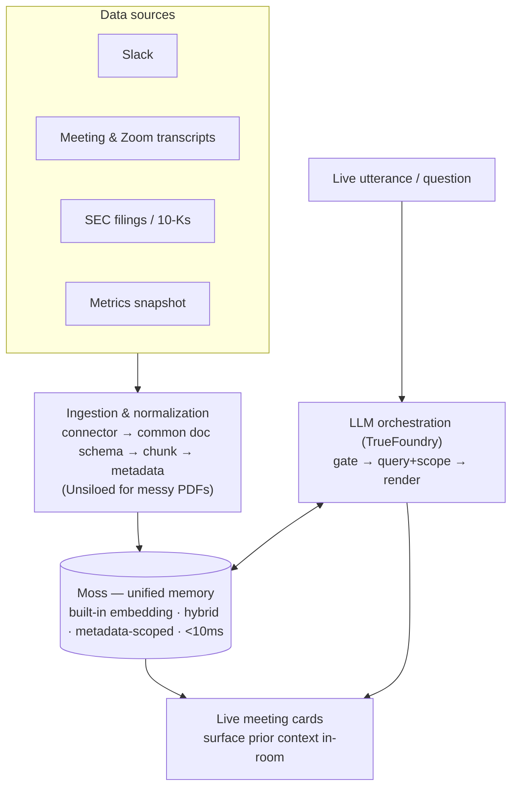

# PRD — Financial Decision Co-Pilot

*(working title — the meeting copilot is the core surface, not the whole product)*

**Status:** v0, hackathon scope (24h) · **Event:** Conversational AI Hackathon (YC / Moss), June 6–7 2026

---

## One-liner

A company's financial context — Slack threads, meeting transcripts, filings, metrics — is scattered across tools and human memory. This copilot unifies all of it into one fast, queryable memory and surfaces the relevant prior context *live in the room* when a financial decision is being made. So "we talked about this somewhere" and "let me get back to you" stop being how high-stakes calls get made.

## Why now / the wedge

High-stakes financial decisions — layoffs, budget cuts, earnings prep, big spend — get made in meetings where the supporting context isn't present. It was decided in a Slack thread three weeks ago, buried in last quarter's transcript, or sitting in a filing nobody reread. The fact isn't in the room, so the decision slips or gets made on vibes.

Existing tools each own one slice and none close the loop live: meeting assistants (Granola, Gong) work *after* the call; enterprise search (Glean) is a separate tab you context-switch into. The wedge is unifying spoken/written history **and** documents into one memory, and retrieving from it fast enough to land *before the next sentence*.

---

## ⚠️ Scope: north-star vs. v0 (read this first)

The architecture below describes the **full vision**. The 24-hour build ships a deliberately small slice of it. Do not build the whole thing.

| | North-star (the vision / what we scaffold toward) | **v0 — what actually ships in 24h** |
|---|---|---|
| Sources | Slack, Zoom, live meeting audio, EDGAR filings, internal metrics, CRM | Live transcript (LiveKit) + **Slack seeded** + a metrics snapshot + a couple of seed docs/filings |
| Ingestion | Live connectors, scheduled sync | **Seed-time ingest only** (scripted, pre-demo) |
| Surfaces | Live cards (+ dashboards later) | **Live cards only** |
| Memory | Multi-company, retention, privacy scoping | One company, one group thread |
| Decisions | "should we lay off / cut budget" framing | **surface evidence, cited — humans decide** |

The v0 demo is the meeting copilot core, pointed at a financial scenario, with Slack as a second source. Everything else is connectors and surfaces the architecture is *designed for* but we don't build on the clock.

---

## Non-Goals (v0)

- **Voice output.** Display-first; the agent shows, it doesn't talk over the meeting. (MiniMax TTS is a P2 toggle.)
- **Visualizations / dashboards.** Deferred — not in v0. Metrics are retrievable as text (e.g. "enterprise churn Q2 = X"), but no charts.
- **Investment/financial advice or buy/sell/layoff recommendations.** The tool surfaces evidence (prior decisions, what was said where, risks) with citations. Humans make the call. An AI making confident financial calls is neither credible nor defensible.
- **Note-taking / summaries.** Crowded post-call market; we write decisions back to memory but don't generate minutes.
- **Live connectors, auth, multi-tenant.** Seed data only in 24h.
- **Mobile.**

---

## Architecture



### The key abstraction: one normalized document

Every source is a **connector** that emits the same shape. This is what makes new sources cheap and lets the agent scaffold uniformly.

```jsonc
{
  "id": "slack:C123:p1699...",        // stable, source-prefixed
  "text": "...",                       // the chunk to embed/search
  "source": "slack | transcript | filing | metric | doc",
  "group_id": "acme-finance-weekly",   // the thread/topic scope
  "user_id": "priya | null",           // who said/owns it (for attribution)
  "timestamp": "2026-05-01T...",
  "url": "https://slack.com/...",      // permalink for the citation
  "is_decision": false,
  "meta": { /* source-specific extras */ }
}
```

- **Slack** → one doc per message (or per thread), thread-aware, `user_id` from author.
- **Transcripts** (LiveKit live + uploaded Zoom) → one doc per turn segment.
- **Filings / 10-Ks** → Unsiloed parses the PDF → chunked docs, `meta` carries filing type + section.
- **Metrics** → a KPI snapshot; a text summary row per metric goes into Moss for retrieval ("enterprise churn Q2 = X"). No time-series / charts in v0.

Retrieval is then uniform: `Moss.query(index, query_text, filter={group_id, source?, user_id?})` hits **all** sources in one round trip, scoped by metadata.

### Component responsibilities

| Component | Role |
|---|---|
| **Connectors** | One adapter per source → normalized docs. Pluggable; adding a source = adding a connector. |
| **Ingestion** | Chunk per source type, attach metadata, write to Moss. Unsiloed for messy PDFs. Seed-time in v0. |
| **Moss** | Unified memory + retrieval. **Built-in embedding (`moss-minilm`)** embeds both ingest and query — no embedding service, no embedding-space mismatch. **Hybrid** (semantic + keyword) via `alpha`. **Metadata filtering** (`$eq/$and/$in`) for source/group/user scoping. In-process — no network hop on the hot path; indexes sync to Moss Cloud. |
| **LLM orchestration (via TrueFoundry)** | **One fast call** per candidate utterance → `{retrievable, query, scope}`. A second call *only* to compress messy unstructured chunks into a card; structured records skip it. Route the hot-path call to a fast model (MiniMax HighSpeed or equiv.), US/global endpoint. TrueFoundry gives routing, cost governance, and the judge-facing latency panel. |
| **Live cards surface** | Renders the surfaced answer in-room with source attribution + permalink. |
| **MiniMax** | LLM option via the gateway. Optional TTS (P2). **Not** used for embeddings. |

### The per-utterance loop (hot path, <1s)

```
transcript turn → 1 fast LLM call {retrievable?, query, scope}
   → (if retrievable) Moss.query(text, filter=scope)   // all sources, one round trip, <10ms
   → structured record → template card (NO LLM)
     OR messy chunk → optional 2nd LLM call to compress
   → card on screen (<1s)
async, off hot path: new transcript turns + logged decisions → Moss.add_docs(...)
```

---

## Demo scenario (v0)

A finance leadership meeting reviewing whether to cut a budget line. Seeded context: a Slack thread where the team debated it three weeks ago, a prior meeting transcript with a related decision, a parsed filing/contract, a metrics snapshot.

- **Hero moment:** someone says "didn't we go back and forth on this in Slack?" → the thread + the prior decision + owner appears on screen in <1s with a permalink → decision made live, no action item. Follow with the same query lagging on a networked vector DB.

---

## Requirements (v0)

### Must-Have (P0)

- **Live transcription** (LiveKit), single-stream, < ~2s caption lag. No speaker labels required at P0.
- **Multi-source seed:** Slack export + transcripts + a metrics snapshot + 1–2 docs, all normalized into one Moss index with metadata.
- **Retrievable-question gate** — one fast structured LLM call returning `{retrievable, query, scope}`; conservative, tuned on the 15-question eval set.
- **Cross-source retrieval** — one `query` with a `group_id` filter hits Slack + transcripts + docs together; single-digit-ms on the seeded corpus.
- **Answer card** — structured records render via template (answer + source + permalink: "from Slack, [date]" / "Decided in [meeting]"); LLM synthesis only for unstructured chunks; end-to-end < 1s on the happy path.
- **Memory write-back** (async) — transcript turns + a manually-flagged decision written to Moss, retrievable later.
- **Retrieval-latency comparison** — Moss vs. a **networked** vector DB on the same query.

### Nice-to-Have (P1)

- Person-scoped attribution (from seeded `user_id`, not live diarization).
- Empty/low-confidence state ("no strong match" instead of bluffing).
- Live TrueFoundry observability panel.
- A second live source wired (e.g., a real Slack connector instead of seed export).

### Future / P2 (north-star)

- Live connectors (Slack, Zoom, EDGAR sync, CRM). MiniMax voice output. **Dashboards / trend visualizations (deferred).** Multi-company memory, retention, privacy scoping. Auth, multi-tenant, deploy.

---

## Suggested repo scaffold (for the build agent)

```
/connectors        # one adapter per source → normalized docs
  slack.py
  transcripts.py   # LiveKit live + uploaded Zoom
  filings.py       # EDGAR fetch + Unsiloed parse
  metrics.py       # KPI snapshot → text summary rows for retrieval
/ingest            # chunking per source, metadata, write to Moss
/memory            # Moss client wrapper: create_index, query(filter), add_docs (write-back), scoping
/agent             # LLM orchestration via TrueFoundry: gate→query→scope, optional synth
/api               # backend endpoints (query, write-back)
/web               # frontend: live cards
/eval              # 15-question fixtures + latency harness (Moss vs networked baseline)
/seed              # seed data: slack export, transcripts, metrics, docs
```

Contract between layers is the normalized doc schema above. Connectors only need to emit it; `/ingest`, `/memory`, and `/agent` never know which source a doc came from (except via the `source` field for scoping/filtering).

---

## Success criteria (hackathon)

**Demo:** the hero moment lands in <1s; each of the seeded question types fires once cleanly; the gate stays quiet through ~30s of non-question talk (**P0 acceptance bar**).

**Credibility:** eval slide with **precision@k** and **p50/p95 retrieval latency** on the 15-question set, Moss vs. baseline. Compare *retrieval latency* against a **networked** vector DB — not end-to-end (LLM-dominated, identical both arms) and not a local FAISS (also sub-ms at this scale, so the delta vanishes).

---

## Open questions

- **[Eng] Embedding — RESOLVED.** Moss built-in `moss-minilm`, same model ingest + query. Confirm recall on the eval set in hour 0; `moss-mediumlm` is the fallback.
- **[Eng] Slack seed format.** Use a Slack export JSON → `slack.py` connector. Confirm thread structure maps cleanly to `group_id`.
- **[Eng] Hot-path latency.** One fast structured call (MiniMax HighSpeed via TrueFoundry, US endpoint); synthesis off the critical path for structured records.
- **[Eng] Write-back timing.** Async per-turn, fire-and-forget.
- **[Product] Source disagreement** (Slack says X, filing says Y) — surface both with sources, let the room judge.
- **[Data] Metrics snapshot** — internal seed table, or pull a public co's figures from EDGAR's XBRL `companyfacts` API if we want that story. Text rows only (no charts in v0).

---

## Top risks

1. **Scope.** The vision is multi-source + dashboards; the clock is 24h. Build the v0 cut, not the north-star. New sources beyond Slack are the first thing to drop.
2. **The retrievable-question gate.** False positives — cards flashing every sentence — kill the demo faster than latency. Conservative, tuned on the eval set.
3. **The latency comparison.** Networked baseline, retrieval slice only, or the win is invisible at toy scale.

**Cut line:** if the build slips, drop (in order) extra sources → the latency eval. Never the hero moment. The "we discussed this → it appears live → decision made" beat is the pitch; everything else is supporting evidence.

---

## 24-hour phasing

- **0–4 — Spine.** Confirm Moss index/query/filter API. LiveKit audio→transcript on screen. Normalized schema + `/memory` wrapper. Seed Slack + transcripts + docs into one index with metadata. Hardcoded query→templated card path, no LLM.
- **4–10 — Intelligence.** Single gate/query/scope LLM call via TrueFoundry. Cross-source retrieval by filter. Async write-back.
- **10–16 — Hero + numbers.** Seed the Slack thread + prior decision so the hero lands. Networked-baseline latency comparison + 15-question eval.
- **16–20 — Polish + cut.** Tune the gate against false positives. Card UX, attribution, permalinks, empty state.
- **20–24 — Rehearse.** Lock the script around the hero. Freeze; only fix breakages. Practice the 90s pitch.
