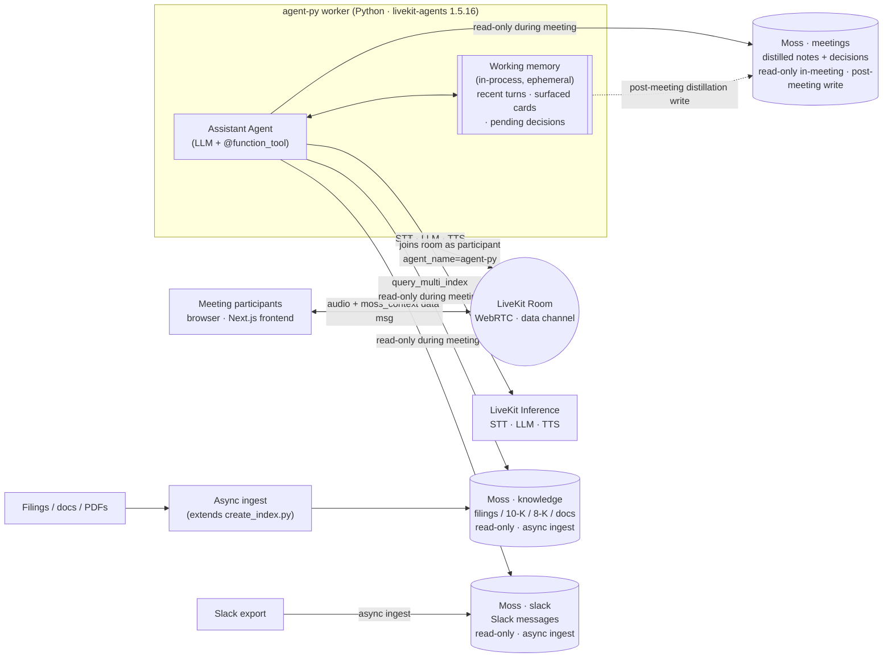

# Technical Architecture & Design — tellmequick: Decision & Context Co-Pilot (v0)

**Companion to:** [financial-prd-final.md](./financial-prd-final.md). The PRD covers *what* we ship and *why*; this doc covers *how* — interfaces, sequence, latency budget, failure modes, deploy topology. Assumes the PRD is read.

**Product framing:** tellmequick is a real-time decision and context copilot — domain-agnostic. The v0 demo is a financial leadership meeting (PRD §Demo scenario), but the product and architecture are general; nothing below assumes finance.

**Grounded in the scaffold.** This repo is based on `livekit-examples/moss-hacker-starter` (see [agent-py/AGENTS.md](./agent-py/AGENTS.md)). The design below extends the scaffold rather than replacing it — same `MossClient`, same `@function_tool` pattern, same `AgentServer` + `@server.rtc_session` wiring. Where we diverge, we say so.

**Scope:** v0 / 24h hackathon. Pin choices that unblock the build; flag the rest in §12.

---

## 1. System context



One LiveKit room per meeting. Frontend = Next.js + `@livekit/components-react`. The `agent-py` worker joins as a programmatic participant of kind `AGENT` (explicit dispatch via `agent_name="agent-py"`). The hot path lives entirely inside that worker. **LiveKit Inference handles STT, LLM, and TTS** — there is no separate LLM gateway (no TrueFoundry, no MiniMax). Moss runs as a managed service via `MossClient`; all three indexes are pre-loaded into the worker on `Agent.on_enter` to keep the first query fast.

**Key property: Moss is read-only during a live meeting.** The agent only *reads* from the three indexes while a meeting is in progress. Nothing is written to Moss on the hot path — no live transcript write-back, no mid-meeting `remember_fact`. Raw turns live only in in-process working memory. The `meetings` index is written **once, after the meeting**, by a distillation pass. This removes self-citation, mid-meeting index-reload latency, and write-contention from the hot path entirely.

**Three Moss indexes + working memory** (detailed in §5). Moss caps this account at **3 indexes** (verified — a 4th returns `429 USAGE_LIMIT_EXCEEDED`), so three is both our design and the ceiling.
- **`knowledge` (read-only)** — filings, 10-K / 8-K, documents, PDFs. Async ingest via an extended `create_index.py`; never touched during a meeting.
- **`slack` (read-only)** — Slack messages. Async ingest, independent of meetings.
- **`meetings` (read-only in-meeting, written post-meeting)** — distilled important information + decisions from past meetings. **Not raw transcripts.** Written by the end-of-meeting distillation pass (§6.2), which resolves within-meeting conflicts so only the latest decision survives.
- **Working memory (in-process, ephemeral)** — recent turns, surfaced cards (dedup), pending decisions. The sole live-mutated store during a meeting; feeds the post-meeting distillation. Dies with the worker.

---

## 2. LiveKit Agents session lifecycle

We extend the scaffold's structure in [agent-py/src/agent.py](./agent-py/src/agent.py). One worker process; one room per job; one session per room.

```
process start
  → AgentServer() + @server.rtc_session(agent_name="agent-py")
  → prewarm(JobProcess): proc.userdata["vad"] = silero.VAD.load()
  → on job dispatch (frontend supplies {"group_id": ...} in ctx.job.metadata):
      group_id = json.loads(ctx.job.metadata).get("group_id", DEFAULT_GROUP_ID)
      session = AgentSession(
          stt = inference.STT(model="deepgram/nova-3", language="multi"),
          tts = inference.TTS(model="cartesia/sonic-3", voice=...),
          turn_detection = MultilingualModel(),
          vad = ctx.proc.userdata["vad"],
          preemptive_generation = True,
      )
      await session.start(
          agent = Assistant(room=ctx.room, group_id=group_id),
          room = ctx.room,
          room_options = RoomOptions(
              audio_input = AudioInputOptions(
                  noise_cancellation = ai_coustics.audio_enhancement(QUAIL_VF_S),
              ),
          ),
      )
      await ctx.connect()
      await session.generate_reply(instructions="Greet warmly, ...")
      # voice loop runs; tool calls drive READ-ONLY retrieval (no Moss writes)
  → on participant leave / room close:
      → finalize_meeting(): distill working memory → write meetings index (§6.2)
      → session ends, job completes
```

**Extension points** we use:

| Hook | What we do |
|---|---|
| `prewarm` | Load Silero VAD (scaffold); also load distillation prompt template, schema |
| `Agent.on_enter` | Preload all three Moss indexes (`knowledge`, `slack`, `meetings`); init working memory |
| `Agent.__init__` | Wire `MossClient`, `group_id`, `room`, `WorkingMemory` |
| `@function_tool` methods | Read-only retrieval + in-process decision capture (§4) |
| Session-end callback | Trigger post-meeting distillation → `meetings` write (§6.2) |

Conversation = one LiveKit room session. We use the room's `name` as our `conversation_id`.

---

## 3. Hot-path sequence (tool-call pattern)

The scaffold's pattern: the LLM is the "gate". Its system prompt instructs *when* to call `search_context` before answering. We don't write a custom retrievable-question gate — the LLM does it via instructions, which is sufficient for the demo's hero moment (the LLM searches on any reference to prior context). **Every Moss tool on the hot path is read-only** — the agent retrieves but never writes during a meeting.

```mermaid
sequenceDiagram
  participant U as User (browser)
  participant R as LiveKit room
  participant S as AgentSession
  participant A as Assistant (LLM + tools)
  participant W as Working memory (in-proc)
  participant MOSS as Moss · knowledge+slack+meetings
  participant I as LiveKit Inference

  U->>R: audio frames
  R->>S: subscribed track
  S->>I: STT stream (deepgram/nova-3)
  I-->>S: final segment (~200-400ms)
  S->>A: on_user_turn_completed(segment)
  A->>W: append turn (sync, ephemeral)
  S->>I: LLM call (openai/gpt-5.2-chat-latest)<br/>tools = [search_context, mark_decision]
  Note over S,I: preemptive_generation begins during EoT detection
  alt LLM calls search_context
    A->>MOSS: query_multi_index([knowledge, slack, meetings])<br/>READ-ONLY · group_id scope
    MOSS-->>A: merged SearchResult (source-tagged)
    A->>W: filter — drop docs already surfaced this session
    A->>R: publish_data(moss_context, reliable=True)
    R->>U: card appears in context panel
    A-->>S: tool results joined as plain text
    S->>I: LLM continuation (synthesizes spoken reply from results)
  end
  I-->>S: streamed reply tokens
  S->>I: TTS stream (cartesia/sonic-3)
  I-->>R: audio frames
  R->>U: agent speaks (perceived ~500-900ms after EoT)
  Note over A,MOSS: NO writes to Moss during the meeting. mark_decision only<br/>touches working memory; persistence happens post-meeting (§6.2).
```

### Latency budget (target p95, "voice + card" path)

| Stage | Budget | Notes |
|---|---|---|
| STT finalization | 200–400ms | `deepgram/nova-3` multilingual; preemptive_generation can hide some of this |
| LLM first token | 300–600ms | `openai/gpt-5.2-chat-latest` via Inference; preemptive overlap helps |
| Tool round-trip (`query_multi_index` over 3) | 50–150ms | Moss SaaS, one multi-index call; bound by the slowest index, not the sum |
| Working-memory filter | <5ms | Plain Python over a small list |
| `moss_context` publish | 20–60ms | Reliable data channel; frontend hook renders on receipt |
| LLM synthesis continuation | 200–500ms | Tool results joined; LLM continues to spoken reply |
| TTS first audio | 150–300ms | `cartesia/sonic-3` streams from first token |
| **End-to-end (perceived first speech)** | **~1.0–2.0s** | Tighter on no-tool turns (skip the tool round-trip + continuation) |
| **End-to-end (card on screen)** | **~0.7–1.2s** | Card publishes immediately after the tool call returns, before TTS finishes |

Card-on-screen is faster than first-speech because we publish `moss_context` as soon as the tool returns; the LLM is still synthesizing. This matches the PRD's "card lands before the next sentence" target.

---

## 4. Function tools — the agent's surface area

We reshape the scaffold's tools around the read-only-in-meeting model. The scaffold's `remember_fact` / `recall_facts` (per-user mid-conversation writes) are **removed** — they don't fit a model where Moss isn't written during the meeting. Persistence is the post-meeting distillation pass instead (§6.2). All tools live on `Assistant` in `agent-py/src/agent.py`.

| Tool | Reads | Writes? | Publishes `moss_context`? | Purpose |
|---|---|---|---|---|
| `search_context(query, sources?)` | `knowledge` + `slack` + `meetings` via `query_multi_index` | No | Yes | The one retrieval tool. Surfaces relevant prior context across all sources in a single call; optional `sources` filter to scope (e.g. only `slack`). Hits return source-tagged for provenance. |
| `mark_decision(text, owner?)` | — | No (in-proc only) | Yes (banner) | Capture a decision flagged live in the room. Appends to working memory; persisted to `meetings` post-meeting. |
| `clarify_source(doc_id)` | the index that owns `doc_id` | No | Yes | Pull the full source text for an already-cited card ("what was the exact wording?"). |

Keeping retrieval as **one** `search_context` tool (rather than one-per-index) matches the product — "surface relevant context, wherever it lives" — and lets a single `query_multi_index` round-trip cover all three indexes. The optional `sources` arg is there for the rare case the LLM wants to scope (e.g. "what did we say in Slack").

**System-prompt gating** (extends the scaffold's `instructions`): the LLM is told to call `search_context` for *any* reference to prior discussion, a specific document, a Slack thread, or a past decision. False positives are inexpensive — the worst case is a silent extra read. False negatives are the demo-breaking case, so the prompt skews aggressive.

**`moss_context` payload contract** (frozen by `useMossContextEvents.ts`):

```jsonc
{
  "type": "moss_context",
  "data": {
    "query": "<the search string>",
    "matches": [
      { "text": "...", "score": 0.92, "metadata": {"source": "slack", "url": "..."} }
    ],
    "time_taken_ms": 8.3,
    "timestamp": 1717628400.512    // epoch SECONDS; frontend multiplies by 1000
  }
}
```

`mark_decision` publishes a sibling type (e.g. `decision_pending`) on the same data channel so the frontend can render a different banner. Same publish path (`room.local_participant.publish_data(..., reliable=True)`), different `type` discriminator.

---

## 5. Memory layer — three Moss indexes + working memory

### 5.1 `knowledge` index (offline)

Filings, 10-K / 8-K, documents, PDFs. Read-only at runtime; ingested async via an extended `create_index.py` and never touched during a meeting. A refresh (new filing) is just a re-ingest, off the hot path.

**Doc shape** — uses Moss's `DocumentInfo(id, text, metadata)`. Constraints:
- **Moss metadata values are strings only.** Booleans and timestamps must be stringified — `create_index.py` does this with `{str(k): str(v) for ...}`. So `is_decision` is `"true"`, not `true`.
- **`id` is stable and deterministic** — `{source}:{native_id}[:{chunk_n}]` — so re-running ingest is idempotent.
- **`metadata.source`** ∈ `filing | doc` here; the frontend uses it to label cards.

`knowledge.json` (the scaffold's seed file) becomes the seed for filings/docs. Adding documents = adding entries before running `create_index.py`.

### 5.2 `slack` index (offline)

Read-only at runtime. Slack messages, ingested async and independently of meetings (a refresh is just a re-ingest). One doc per message or per thread, `metadata.source = "slack"`, `metadata.user_id` = author for attribution, permalink in `metadata.url`. Same string-only metadata rule.

Kept separate from `knowledge` because it's a distinct source with its own ingest cadence and its own provenance label — and at 3 indexes we have the room. (If a 4th source ever needed a slot, `slack` + `knowledge` are the natural merge, since both are async read-only.)

### 5.3 `meetings` index (distilled, post-meeting write)

The organizational memory of what past meetings concluded. **Holds distilled important information + decisions — not raw transcripts.** Read-only during a live meeting; written once, after the meeting, by the distillation pass (§6.2).

- **Scoped by `group_id`** (the team/topic), not per-user — meeting decisions are shared context, a departure from the scaffold's per-user `memory`. For the v0 demo (one group) this is effectively unscoped.
- **`metadata.kind`** ∈ `decision | note`. **`metadata.is_decision`** = `"true"` for decisions (small score boost at rerank).
- **`metadata.conversation_id`** ties docs back to the meeting that produced them, for idempotent re-writes.
- **Within-meeting conflict resolution:** the distillation pass dedupes contradictory statements from the *same* meeting and keeps only the latest decision (§6.2). The index never stores both sides of a flip-flop from one meeting.
- **Cross-meeting reconciliation is a known gap (TODO).** When a *later* meeting contradicts an *earlier* one, both currently persist; retrieval leans on recency/score to surface the newer one. A real merge/supersede policy across meetings is deferred — see §12.

### 5.4 Working memory (in-process)

The agent's awareness of the current meeting. Lives in `Assistant`'s Python state; not in Moss. **The only store mutated during a meeting.**

```python
@dataclass
class WorkingMemory:
    conversation_id: str          # = ctx.room.name
    group_id: str
    turns: deque[Turn]            # bounded (~50, ring buffer)
    surfaced_cards: list[Card]    # for dedup (don't flash the same source twice)
    pending_decisions: list[Decision]  # populated by mark_decision tool
    started_at: datetime
```

Three roles:
1. **Dedup** — after `search_context` returns, drop docs whose ids already appear in `surfaced_cards`. Prevents the same source flashing twice.
2. **Decision capture** — `mark_decision` appends here; nothing hits Moss yet.
3. **Distillation input** — `turns` + `pending_decisions` are what the post-meeting pass distills into the `meetings` index.

Working memory is **not durable**. If the worker crashes mid-meeting, the active session's state is lost — but all three Moss indexes are unaffected (they're read-only during the meeting), so a re-join resumes with full retrieval and empty working state. The only thing at risk is *this* meeting's not-yet-distilled decisions. P2: periodic SQLite snapshot.

### 5.5 Accessing the indexes

The scaffold's pattern of calling `MossClient` directly inside each `@function_tool` works; a thin wrapper to centralize `group_id` scoping and the `query_multi_index` fan-out is optional. The existing `_FakeMossClient` in [agent-py/tests/test_moss.py](./agent-py/tests/test_moss.py) is the test seam.

---

## 6. Write paths — only two, and only one touches Moss

There is **no Moss write during a meeting.** That is the central simplification of this model.

### 6.1 Per-turn → working memory (sync, in-process)

Every STT-finalized turn is appended to `working_memory.turns` synchronously. No Moss I/O, no async, no ordering concerns, no self-citation. `mark_decision` likewise only appends to `working_memory.pending_decisions`.

### 6.2 Post-meeting → `meetings` index (batched distillation)

Triggered when the room closes (last non-agent participant leaves) or the user ends the meeting. Runs as the final step of the session, off the hot path.

```
on_meeting_end(working_memory):
    # 1. Distill — one LLM call (inference.LLM). Resolve within-meeting
    #    conflicts: if the meeting reversed a decision, keep only the latest.
    distilled = await distill(working_memory.turns, working_memory.pending_decisions)
        # → { notes: [...], decisions: [{text, owner, ts, supersedes?}] }

    # 2. Build batched docs (group-scoped; all metadata values stringified)
    docs = [
        DocumentInfo(
            id=f"{group_id}:{conv_id}:note:{i}",
            text=n.text,
            metadata={"group_id": group_id, "source": "meeting",
                      "conversation_id": conv_id, "kind": "note",
                      "timestamp": now_iso_string()},
        ) for i, n in enumerate(distilled.notes)
    ] + [
        DocumentInfo(
            id=f"{group_id}:{conv_id}:decision:{i}",
            text=d.text,
            metadata={"group_id": group_id, "source": "meeting",
                      "conversation_id": conv_id, "kind": "decision",
                      "is_decision": "true", "owner": d.owner or "",
                      "timestamp": d.ts_iso},
        ) for i, d in enumerate(distilled.decisions)
    ]

    # 3. Append + reload
    await moss.add_docs(MEETINGS_INDEX, docs)
    await moss.load_index(MEETINGS_INDEX)

    # 4. On failure: 3x retry with backoff, then JSONL crash dump
```

- **Idempotent** — deterministic ids keyed on `conv_id`. Re-running the distillation overwrites that meeting's docs in place.
- **Raw transcripts are never written** — by design. Only distilled notes + decisions.
- **Within-meeting conflicts resolved before write** — only the latest decision survives, so the index never holds both sides of a same-meeting reversal.
- **Failure handling** — 3× retry with backoff; on final failure dump `working_memory` to `/tmp/lkdistill-{conv_id}.jsonl` and re-run later with `tools/replay_distill.py`.

---

## 7. Failure modes & fallbacks

| Mode | Symptom | Fallback |
|---|---|---|
| STT stalls / no final segment | No turn fires; no card; no reply | `MultilingualModel` turn detector + Silero VAD usually cover this. Hard 1.5s silence forces finalization. |
| LLM doesn't call `search_context` when it should | Hero moment misses — bluffed answer | System prompt explicitly says: "for ANY reference to prior discussion / a document / a past decision, ALWAYS call `search_context` BEFORE you answer". Eval set regression-tests this. |
| `search_context` returns nothing | Empty card | Tool returns "No relevant context found." The LLM, per instructions, says so honestly rather than guessing. |
| LiveKit Inference LLM timeout | Voice loop stalls | Bound by AgentSession defaults; surfaces as no reply. Demo posture: run a small canary query at startup to catch a degraded endpoint. |
| TTS error | No audio; card still publishes | Frontend's voice indicator goes idle but the context panel still updates — degraded but not silent. |
| Moss query error | Tool returns a graceful "couldn't search right now" string | Existing `try/except` wraps `_publish_moss_context`; extend it to the `query_multi_index` call. Read-only path means a failure can't corrupt state. |
| Worker crashes mid-meeting | Cards stop; voice stops; working memory lost | Worker auto-restart via LiveKit Cloud dispatch. All three indexes are read-only during the meeting, so they're untouched — a re-join resumes full retrieval. Only *this* meeting's un-distilled decisions are lost. P2: periodic working-memory SQLite snapshot. |
| Post-meeting distillation fails | Meeting's notes + decisions not persisted | 3× retry with backoff. On final failure, dump `working_memory` to `/tmp/lkdistill-{conv_id}.jsonl`; `tools/replay_distill.py` re-runs against Moss when available. |
| Later meeting contradicts an earlier one | Stale decision still retrievable | Known gap (cross-meeting reconciliation, §12). Recency/score surfaces the newer doc; no hard supersede yet. |
| Moss SaaS unreachable | Reads fail (no writes happen mid-meeting anyway) | `search_context` returns a graceful string; the meeting continues without retrieval. The post-meeting distillation queues to the local crash file and re-runs later. |

---

## 8. Deployment topology

v0:

```
Browser (Vercel-hosted Next.js — frontend/)
  ↕ LiveKit Cloud (managed SFU + agent dispatch)
       — dispatches to agent_name="agent-py"
  ↕ agent-py worker (single Python process)
       — local laptop OR LiveKit Cloud (Dockerfile included in agent-py/)
       — uv run python src/agent.py {console|dev|start}
       — env (agent-py/.env.local):
           LIVEKIT_URL, LIVEKIT_API_KEY, LIVEKIT_API_SECRET
           MOSS_PROJECT_ID, MOSS_PROJECT_KEY
           MOSS_KNOWLEDGE_INDEX=knowledge   # filings / docs
           MOSS_SLACK_INDEX=slack           # slack messages
           MOSS_MEETINGS_INDEX=meetings     # distilled notes + decisions
           MOSS_MODEL_ID=moss-minilm
  ↕ Moss SaaS (managed; all three indexes live here)
  ↕ LiveKit Inference (managed; STT/LLM/TTS)
```

> **Scaffold divergence:** the starter ships `MOSS_INDEX_NAME=knowledge` + `MOSS_MEMORY_INDEX_NAME=memory`. We replace the two-var scheme with the three above. `create_index.py` and `agent.py` need updating to read the new names and build/load all three.

**Demo posture:** run the worker on the demo laptop in `dev` mode. Removes a network hop and any cold-start risk. Acceptable because we control the room and audience.

**Group identity:** the frontend dispatches with `{"group_id": <team/topic id>}` in agent metadata. The worker parses it from `ctx.job.metadata` before `ctx.connect()` so the `meetings` scope is correct from turn 1. (v0 demo: a single group, so this is effectively constant.)

---

## 9. Tech stack (pinned to scaffold)

| Layer | Choice | Source of truth |
|---|---|---|
| Agent runtime | `livekit-agents[silero,turn-detector]==1.5.16` | `agent-py/pyproject.toml` |
| Inference | LiveKit Inference (STT/LLM/TTS) | `agent-py/src/agent.py` |
| STT | `deepgram/nova-3` (multilingual) | as above |
| LLM | `openai/gpt-5.2-chat-latest` | as above |
| TTS | `cartesia/sonic-3` | as above |
| Turn detector | `MultilingualModel()` (livekit-plugins-turn-detector) | as above |
| VAD | Silero (preloaded in `prewarm`) | as above |
| Noise cancellation | `livekit-plugins-ai-coustics~=0.2`, model `QUAIL_VF_S` | `pyproject.toml` |
| Memory | `moss>=1.4`, embedding `moss-minilm`, 3 indexes (`knowledge`/`slack`/`meetings`) | `pyproject.toml`, `.env.example` |
| Package manager | `uv` | AGENTS.md |
| Lint | `ruff` (`uv run ruff format/check`) | AGENTS.md |
| Tests | `pytest` + `pytest-asyncio` (asyncio_mode="auto") | `pyproject.toml` |
| Frontend | Next.js + `@livekit/components-react` | `frontend/` |
| Container | Provided `Dockerfile` (production-ready) | `agent-py/Dockerfile` |

Adding a new package = `uv add <pkg>` in `agent-py/`.

---

## 10. Testing posture (AGENTS.md mandate)

AGENTS.md is explicit: when modifying core behavior (instructions, tool descriptions, workflows), **always TDD**. The existing test patterns to follow:

- **`agent-py/tests/test_moss.py`** — unit tests for `@function_tool` methods, with `_FakeMossClient` (records calls, no network). Pattern: monkeypatch `agent_module.MossClient` to the fake, instantiate `Assistant`, set `assistant._moss.query_result = _FakeSearchResult([...])`, call the tool, assert on the indexes queried, the `group_id` scope, and the published `moss_context` payload.
- **`agent-py/tests/test_agent.py`** — LLM-judged evals for end-to-end behavior.

Since we're removing `remember_fact` / `recall_facts` and adding `search_context` / `mark_decision`, the existing `test_moss.py` cases for those tools get rewritten (TDD-first per AGENTS.md). The post-meeting distillation gets its own test with a deterministic stub LLM, asserting within-meeting conflict resolution (a reversed decision yields one doc, the latest).

---

## 11. Cross-cutting concerns (deferred)

- **Auth / multi-tenant** — not in v0; single demo group, frontend supplies `group_id`.
- **Observability** — LiveKit Agent Observability is built in (see scaffold README); also `uv run` writes stdlib logs to stdout. No external tracing in v0.
- **Secret management** — `.env.local`, not committed. Demo machine only.
- **Data retention** — none; everything wiped post-demo. Moss indexes can be dropped manually.
- **Workflows / handoffs / tasks** (AGENTS.md highlights these) — not used in v0; a single `Assistant` covers the demo. Worth considering for v1 if we add multi-phase flows (e.g. "now summarize" vs. "now find context").

---

## 12. Open technical questions (hour-0 spikes)

1. **Three-index ingest.** Build `create_index.py` to create `knowledge` (filings/docs) + `slack` (messages) and an empty `meetings`. Verify chunking + metadata-string coercion don't break recall on the eval set. **Watch the 3-index cap** — we have exactly 3 slots, none to spare. 45 min.
2. **`query_multi_index` behavior.** Confirm a single multi-index query merges + scores across `knowledge` + `slack` + `meetings` sensibly (vs. needing per-index queries + a manual merge). Check `group_id` filtering works on `meetings`. 30 min.
3. **System-prompt gating efficacy.** Run the 15 fixture questions against `Assistant` with our extended instructions; confirm `search_context` fires for each. Tune if not. 30 min.
4. **Distillation prompt + within-meeting conflict resolution.** Spike `distill(turns, decisions)` on 2–3 seeded transcripts, including a deliberate same-meeting decision reversal — confirm only the latest survives, and that the output is useful when later retrieved. 45 min.
5. **`mark_decision` UX.** Frontend needs a button. Wire the data-channel publish (`type: "decision_pending"`) end-to-end. 30 min.
6. **Post-meeting `add_docs` + `load_index` cost.** Off the hot path, so latency is non-critical, but confirm the write+reload completes before the worker exits on room close. 15 min.
7. **Cross-meeting reconciliation (TODO — deferred).** When a later meeting contradicts an earlier one, both currently persist in `meetings`. Need a supersede/merge policy (e.g. mark older decisions `superseded_by`, or re-distill the affected topic across meetings). Out of scope for v0; recency/score is the interim. **This is the known gap the user flagged.**
8. **Retention/privacy** — `meetings` is group-scoped org memory; a pilot needs a `forget(group_id, conversation_id?)` path. Out of scope for v0.

---

## 13. Cross-references

- Scope, non-goals, success criteria: [financial-prd-final.md](./financial-prd-final.md)
- Scaffold conventions: [agent-py/AGENTS.md](./agent-py/AGENTS.md)
- Agent code: [agent-py/src/agent.py](./agent-py/src/agent.py)
- Index seeding: [agent-py/src/create_index.py](./agent-py/src/create_index.py)
- Tool test pattern: [agent-py/tests/test_moss.py](./agent-py/tests/test_moss.py)
- Environment: [agent-py/.env.example](./agent-py/.env.example)
