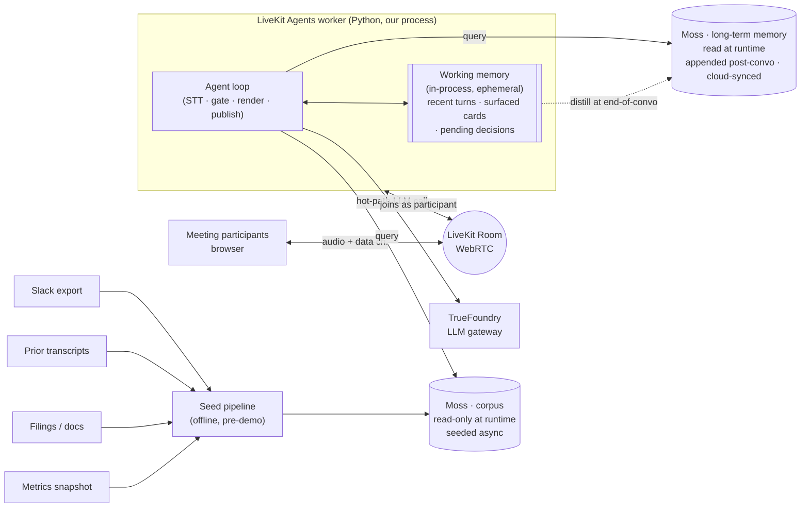
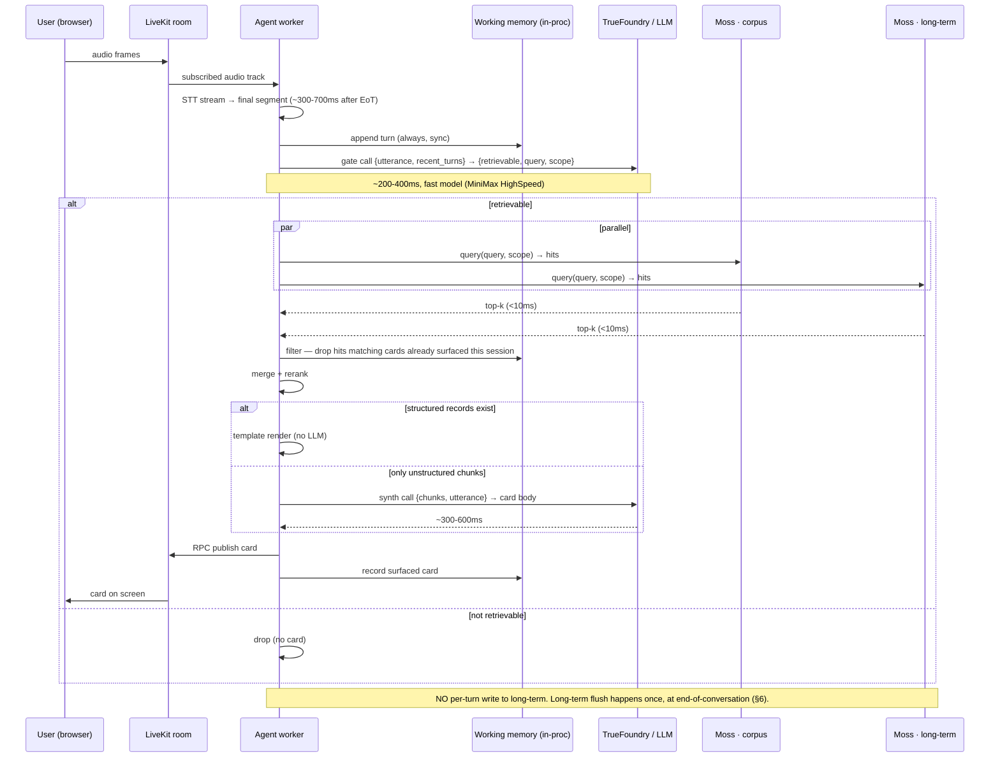

# Technical Architecture & Design — Financial Decision Co-Pilot (v0)

**Companion to:** [financial-prd-final.md](./financial-prd-final.md). The PRD covers *what* we ship and *why*; this doc covers *how* — interfaces, sequence, latency budget, failure modes, deploy topology. Assumes the PRD is read.

**Scope:** v0 / 24h hackathon. Pin choices that unblock the build; flag the rest in §11.

---

## 1. System context



One LiveKit room per meeting. Frontend = browser tab using `@livekit/components-react`. Our worker joins as a programmatic participant of kind `AGENT`. The hot path lives entirely inside that worker process.

**Three memory tiers** (detailed in §4):
- **Corpus (Moss, read-only)** — offline-ingested Slack export, filings, prior transcripts, metrics. Built by the seed pipeline; not modified at runtime.
- **Long-term memory (Moss, append-only at runtime)** — distilled facts/decisions/summaries from prior conversations. Read on the hot path; written *once* at end-of-conversation, then synced to Moss Cloud.
- **Working memory (in-process, ephemeral)** — recent turns, surfaced cards (to avoid re-flashing), pending decisions in the active meeting. Dies with the session unless distilled to long-term.

Both Moss indexes run in-process for hot-path reads (no network hop); the cloud sync is async.

---

## 2. LiveKit Agents session lifecycle

We use the LiveKit Agents Python framework. One worker process, dispatched per job.

```
process start
  → register worker with LiveKit Cloud (WS, long-lived)
  → on Job assigned:
      entrypoint(JobContext)
        → AgentSession(stt=Deepgram/AssemblyAI, llm=None, tts=None, vad=Silero)
        → session.start(room, agent=FinanceCopilotAgent())
        → session bridges room audio → STT plugin → on_user_turn_completed
        → our agent overrides on_user_turn_completed to drive the per-utterance loop
        → tools (memory_query, write_back) registered for optional LLM dispatch
        → publish cards via RPC to the frontend participant
  → on participant leave / room close → session ends, job completes
```

Why no LLM in `AgentSession`: we do **not** want the framework's built-in "LLM → TTS reply" loop. The agent doesn't speak; it surfaces cards. We hijack `on_user_turn_completed` to run our own gate → Moss → render path, and publish the result over RPC instead of via TTS.

VAD + turn detection: Silero VAD ships with the framework; we accept default end-of-turn behavior at P0. False-cut tuning is post-v0.

---

## 3. Hot-path sequence (per utterance)



### Latency budget (target p95, structured-record path)

| Stage | Budget | Notes |
|---|---|---|
| STT finalization | 300–700ms | Provider-dependent; AssemblyAI universal-streaming or Deepgram nova-3 |
| Gate LLM call | 200–400ms | One structured JSON output, fast model via TrueFoundry US endpoint |
| Moss queries (parallel: corpus + long-term) | <10ms | Both in-process; bound by the slower index, not the sum |
| Working-memory filter + merge/rerank | <5ms | Plain Python over small lists |
| Template render | <5ms | No LLM |
| RPC publish + render | 50–150ms | LiveKit data channel + React paint |
| **End-to-end** | **<1.5s** | PRD target was <1s; realistic p95 with structured path is ~900ms–1.4s |

Unstructured path adds 300–600ms for the synthesis call. We accept this and prefer structured templates wherever the doc shape allows.

---

## 4. Memory layer — three tiers, distinct lifecycles

The system has three separate memory stores. They differ in *what they hold*, *when they're written*, and *who writes them*. Collapsing them into one index is the wrong abstraction — their write semantics are incompatible (read-only vs append-only vs ephemeral).

| Tier | Store | Lifecycle | Writer | Reader on hot path? |
|---|---|---|---|---|
| **Corpus** | Moss index `corpus` (in-proc + Cloud) | Built once per company, async/offline | Seed pipeline | **Yes** |
| **Long-term memory** | Moss index `ltm` (in-proc + Cloud-synced) | Append-only across conversations; written once at end-of-convo | Agent (end-of-convo flush) | **Yes** |
| **Working memory** | In-process Python state (dataclass / dict) | Ephemeral — lives and dies with the AgentSession | Agent (every turn) | **Yes** (consulted, not queried) |

### 4.1 Corpus index (offline-ingested document corpora)

The historical record: Slack export, prior meeting transcripts (uploaded Zoom), parsed filings, metrics summary rows. Read-only at runtime — the agent never writes here. Built async by the seed pipeline (`/ingest`) before the demo.

**Doc shape** is the normalized schema from the PRD. Enforcement:
- **`id` is stable and deterministic** — `{source}:{native_id}[:{chunk_n}]`. Re-ingesting the same Slack message produces the same id; seed re-runs don't dup.
- **`group_id`** scopes to a company/topic. Every runtime query carries it.
- **`source`** ∈ `slack | transcript | filing | metric | doc`.
- **`timestamp`** is ISO-8601 UTC.

To refresh the corpus (new Slack export, additional filings): re-run `/ingest`. Not on the hot path.

### 4.2 Long-term memory index (agentic, cross-conversation)

What the agent has *learned* from prior conversations: distilled decisions, key facts surfaced, recurring concerns, who-owns-what. Grows monotonically as more meetings happen.

- **Source field**: `source = "ltm"`. Keeps it distinguishable from corpus docs in merged results.
- **Doc id**: `ltm:{conversation_id}:{turn_or_summary_n}`. Idempotent re-flush is safe.
- **`is_decision`** flag is meaningful here — decisions surface with a score boost in §3's rerank.
- **`meta.distilled_from`** carries the conversation id and source turn ids for audit/citation.

**Why a separate index, not just a `source=ltm` filter on corpus**: lifecycle. Corpus is read-only and refreshed by re-ingest; LTM is append-only and grown by the agent. Different writers, different schemas allowed, different retention policies later. Keeping them separate makes the contract clean — and parallel querying costs nothing in-process.

### 4.3 Working memory (in-process, ephemeral)

The agent's awareness of the *current* conversation. Lives in the AgentSession's Python state — not in Moss.

```python
# /agent/working_memory.py
@dataclass
class WorkingMemory:
    conversation_id: str
    group_id: str
    turns: deque[Turn]                       # bounded ring buffer (e.g. last 50 turns)
    surfaced_cards: list[SurfacedCard]       # cards already shown this session
    pending_decisions: list[PendingDecision] # user-flagged but not yet confirmed
    started_at: datetime
```

Three roles on the hot path:
1. **Recent-turn context** — passed into the gate prompt as `recent_context` so the gate can disambiguate ("this" / "that").
2. **De-duplication** — after Moss queries return hits, drop anything whose doc id matches an already-surfaced card. Prevents the same Slack thread flashing twice in one meeting.
3. **Decision capture** — when the user clicks "mark as decision" on a card, record it here. It's promoted to long-term at end-of-convo.

Working memory is not durable. If the worker crashes mid-meeting, the conversation's working state is lost — that's acceptable for v0 (re-joining the room resumes with empty working memory; corpus + LTM are still queryable). Persistence (SQLite snapshot per N turns) is a P2.

### 4.4 Query interface (one wrapper, two indexes)

```python
# /memory/moss.py
class Memory:
    def __init__(self, corpus_index: str, ltm_index: str): ...

    def add_corpus_docs(self, docs: list[Doc]) -> None: ...    # seed time only
    def append_ltm(self, docs: list[Doc]) -> None: ...         # end-of-convo only

    def query_all(
        self,
        text: str,
        group_id: str,
        *,
        sources: list[str] | None = None,
        user_id: str | None = None,
        top_k_per_index: int = 8,
        alpha: float = 0.5,
    ) -> list[Hit]:
        """Fire both indexes in parallel, return merged + rescored hits.
        Each Hit carries `tier ∈ {corpus, ltm}` so the agent can weight or label."""
```

The agent calls `query_all` once per retrievable utterance; the wrapper hides the two-index detail. Rerank applies a small recency boost (LTM hits from today's predecessor meetings beat 6-month-old ones) and a small `is_decision` boost.

---

## 5. The retrievable-question gate

The single most demo-fragile component. PRD calls out false positives as a top-3 risk.

### Call shape

```jsonc
// Input: last STT segment + last ~3 turns of context
{
  "utterance": "didn't we go back and forth on this in slack?",
  "recent_context": ["...", "...", "..."]
}

// Output (structured, validated):
{
  "retrievable": true,
  "query": "budget cut debate slack thread",
  "scope": {
    "sources": ["slack"],            // optional
    "user_id": null                  // optional
  },
  "confidence": 0.82                 // for empty-state fallback
}
```

Model + routing: fast-tier model (MiniMax HighSpeed via TrueFoundry, US endpoint). One call, JSON schema enforced server-side via TrueFoundry's structured-output passthrough or a Pydantic validator + retry on parse fail.

### Tuning posture

- **Default deny.** If the gate returns `retrievable=false` *or* confidence < 0.6, drop. Better to miss than to flash a wrong card.
- **Eval-driven.** The 15-question fixture set in `/eval` doubles as the gate tuning set — precision matters more than recall.
- **Negative examples in the prompt** — small-talk, navigation ("next slide"), affirmations. These must return `false`.

### Why not skip the gate and always query Moss?

Querying is cheap, but *rendering a card* isn't. The cost of a false card on a live demo is the entire pitch. The gate is what keeps the surface quiet.

---

## 6. Write paths — two phases, no per-turn writes to Moss

The system writes in two phases. Per-turn writes go to **working memory only** (in-process, sync, cheap). The Moss LTM index is written **once**, at end-of-conversation, after a distillation pass. This avoids polluting LTM with raw per-turn chatter and prevents the self-citation pathology.

### 6.1 Per-turn → working memory (sync, in-process)

```python
on_user_turn_completed(final_segment):
    working_memory.turns.append(Turn(
        seq=next_seq(),
        speaker=final_segment.participant,
        text=final_segment.text,
        confidence=final_segment.confidence,
        timestamp=now_iso(),
    ))
    # No Moss write here. No I/O.
```

Sync because it's a deque append. No async risk, no ordering questions, no self-citation: turns aren't searchable in Moss yet.

### 6.2 End-of-conversation → LTM flush (one batched write)

Triggered when the room closes (last non-agent participant leaves) or the user explicitly ends the meeting. Runs as the final step of the LiveKit job lifecycle.

```
on_session_end(working_memory):
    # 1. Distill — one LLM call (slower tier OK; we're off the hot path)
    summary_doc = distill(working_memory.turns)
        # → key facts, decisions made, action owners, follow-ups
    decision_docs = [
        Doc(id=f"ltm:{conv_id}:decision:{i}",
            text=d.text, source="ltm", is_decision=True,
            group_id=group_id, user_id=d.owner,
            timestamp=d.ts, url=f"livekit://{conv_id}#t={d.turn_seq}",
            meta={"distilled_from": d.turn_seq, "conversation_id": conv_id})
        for i, d in enumerate(working_memory.pending_decisions)
    ]

    # 2. Append to LTM index — single batched call, retried with backoff
    memory.append_ltm([summary_doc, *decision_docs])

    # 3. Sync to Moss Cloud — fire-and-forget if not already auto-synced
```

- **Idempotent.** `conv_id` is stable for the meeting; re-running the flush (debug) overwrites in place.
- **What we don't write to LTM:** raw turns. Too noisy, retrieval-toxic. Raw transcript can be persisted separately into the corpus archive if the team wants it for future reference — that's a corpus-pipeline concern, not the agent's job.
- **Failure of the flush:** retry up to 3× with backoff before the worker exits. If all retries fail, working memory is dumped to a local JSONL crash file so the conversation isn't lost permanently — a tiny `/ops/replay-flush.py` script can re-flush from disk.
- **Manual decision tagging during the meeting** still works: the frontend "mark as decision" button mutates `working_memory.pending_decisions`. The flush picks it up.

Ordering with the corpus: corpus is never written to at runtime, so there's no cross-tier ordering issue.

---

## 7. Failure modes & fallbacks

| Mode | Symptom | Fallback |
|---|---|---|
| STT stalls / no final segment | No turn fires; no card | Tune VAD; force a finalize on 1.5s silence. Demo: never the bottleneck on seeded scenario. |
| Gate false positive (card on small talk) | Wrong card flashes | Conservative threshold; eval set as regression suite; **dismiss-card** RPC from frontend logs and feeds the prompt's negative examples. |
| Gate false negative on hero question | The hero moment misses | Hero questions are scripted; eval covers them. If it still misses live, gate prompt has a "if the utterance references prior discussion / decision / data point → `retrievable=true`" rule baked in. |
| Moss returns nothing / low score | Empty card | Render explicit "no strong match in memory" state — never bluff. (P1 in PRD; treat as P0-for-demo since it prevents the worst failure: a confident wrong answer.) |
| LLM gate call times out (>800ms) | Drop the turn | Hard timeout in the agent; no card. Log; keep moving. |
| Synth call times out | Show only the citation + first 200 chars of the top hit | Better degraded card than no card, since we know it was retrievable. |
| TrueFoundry routing failure | Gate / synth fails | Direct fallback to MiniMax API key. Pre-configured before demo. |
| Worker crashes mid-meeting | Cards stop; working memory lost | Worker auto-restart from LiveKit Cloud dispatch. Corpus + LTM unaffected (durable in Moss/Cloud); the active meeting's working state is gone — re-joins start with empty turns/surfaced-cards. P2 mitigation: periodic working-memory snapshot to a local SQLite. |
| End-of-convo LTM flush fails | Conversation's learnings not persisted | 3× retry with backoff. On final failure, dump `working_memory` to a JSONL crash file; `/ops/replay-flush.py` re-runs the flush against Moss when next available. |
| Moss Cloud unreachable | In-process indexes unaffected; LTM cloud sync stalls | Reads are local; sync is async, defers until reconnect. End-of-convo flush still writes locally and queues the cloud push. |

---

## 8. Deployment topology

v0:

```
Browser (Vercel-hosted Next.js)
  ↕ LiveKit Cloud (managed SFU + dispatch)
  ↕ Agent worker (single Python process)
       — local laptop or one small Render/Fly box
       — env: LIVEKIT_URL, LIVEKIT_API_KEY/SECRET,
              TRUEFOUNDRY_GATEWAY_URL, MINIMAX_API_KEY (fallback),
              MOSS_API_KEY (Cloud sync)
       — Moss runs in-process; cloud sync optional during demo
```

One worker, one room, one company. No load balancing, no multi-tenant. Frontend authenticates anonymously to LiveKit with a short-lived token issued by a tiny `/api/token` endpoint (FastAPI, same Python process or a separate Vercel route).

Demo posture: **run the worker on the demo laptop** to remove a network hop and any cold-start risk. Acceptable because we control the room and audience size.

---

## 9. Tech stack (pinned where it matters)

| Layer | Choice | Note |
|---|---|---|
| Agent runtime | `livekit-agents` (Python, latest stable) | Worker + AgentSession |
| STT | AssemblyAI universal-streaming OR Deepgram nova-3 | Pick the one with lower observed p95 in hour 0 |
| VAD / turn | Silero VAD via `livekit-plugins-silero` | Default thresholds |
| LLM gateway | TrueFoundry | Structured-output passthrough preferred |
| Hot-path model | MiniMax HighSpeed (or equivalent fast tier) | US/global endpoint |
| Memory | Moss SDK, `moss-minilm` embedding | In-process, Cloud sync |
| PDF parsing | Unsiloed | Only for filings; offline at seed time |
| Backend | FastAPI (tiny — token issuance, RPC bridge if needed) | Same Python venv as the agent |
| Frontend | Next.js + `@livekit/components-react` | Vercel deploy |
| Eval | `pytest` + a JSON fixture set in `/eval` | Latency + precision@k |

Single Python virtualenv, single Node project for the web. No Docker for v0.

---

## 10. Cross-cutting concerns (deliberately deferred)

- **Auth / multi-tenant** — not in v0.
- **Observability** — TrueFoundry's panel for LLM cost + latency. Worker logs via stdlib logging to stdout; tail in a terminal during the demo. No tracing infra.
- **Secret management** — `.env`, not committed. Demo machine only.
- **Data retention** — none; everything wiped post-demo.

---

## 11. Open technical questions (hour-0 spikes)

1. **STT provider choice.** Run AssemblyAI vs. Deepgram on a 60s seeded clip; pick by p95 final-segment latency. ETA 30 min.
2. **TrueFoundry structured output.** Confirm it accepts a JSON schema and rejects unparseable replies (vs. needing client-side Pydantic + retry). 30 min.
3. **Moss embedding recall on the eval set.** Resolved in PRD — confirm in hour 0 with `moss-minilm`; `moss-mediumlm` fallback. 30 min.
4. **Frontend ↔ agent RPC vs. data channel.** RPC for card publishes (typed, request/response), data channel reserved for "dismiss card" feedback. Confirm RPC payload size limits. 15 min.
5. **Hero question phrasing in the eval set.** The exact wording of the demo's hero utterance must be in the gate's positive examples; verify by running the gate against the recorded script before the run-through. 15 min.
6. **Write-back race — resolved by design.** Per-turn writes only hit working memory, not Moss; self-citation is structurally impossible.
7. **Distillation prompt for LTM flush.** What does `distill(turns)` actually return? First cut: one summary doc + one decision doc per `pending_decisions` entry. Spike: run on 2–3 seeded transcripts and eyeball whether the resulting LTM hits are useful when replayed against the gate's eval set. 45 min.
8. **LTM dedup across re-flushed conversations.** Stable `conv_id` handles same-meeting replays, but two meetings discussing the same topic will produce overlapping facts. v0: accept duplication, rely on Moss's hybrid scoring to surface the freshest one. Spike: confirm reranker actually picks the newer one when ties happen. 20 min.
9. **Working-memory bound size.** `turns` is a deque — what's the cap before recent-context truncation hurts the gate? Educated guess: 50 turns ≈ 5–10 min of meeting. Validate on a seeded transcript. 15 min.
10. **LTM retention / privacy.** Out of scope for v0 (single demo company, throwaway data), but the LTM index will need a deletion path (per-user GDPR, per-conversation forget) before any pilot. Flag, don't build.

---

## 12. Cross-references

- Scope, non-goals, success criteria: [PRD](./financial-prd-final.md)
- Repo layout: [PRD §Suggested repo scaffold](./financial-prd-final.md)
- Demo scenario + hero moment: [PRD §Demo scenario](./financial-prd-final.md)
