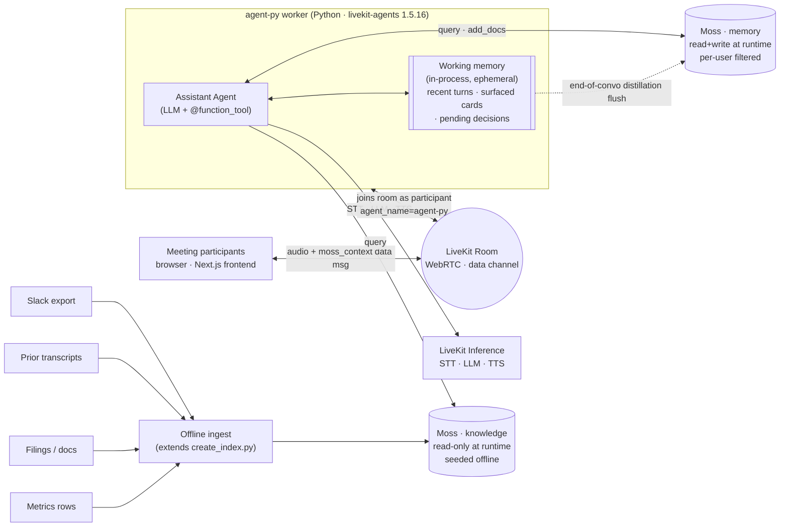
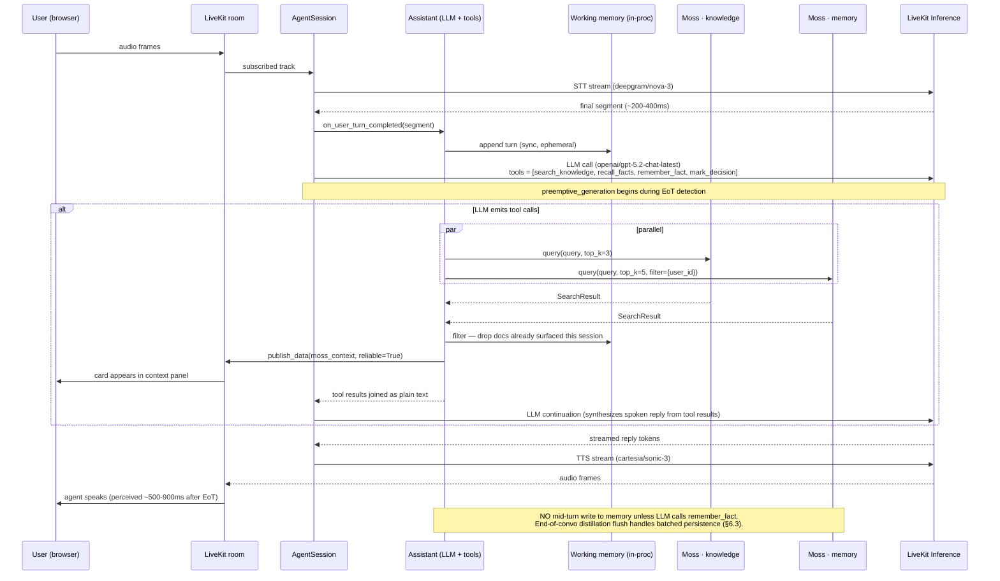

# Technical Architecture & Design — Financial Decision Co-Pilot (v0)

**Companion to:** [financial-prd-final.md](./financial-prd-final.md). The PRD covers *what* we ship and *why*; this doc covers *how* — interfaces, sequence, latency budget, failure modes, deploy topology. Assumes the PRD is read.

**Grounded in the scaffold.** This repo is based on `livekit-examples/moss-hacker-starter` (see [agent-py/AGENTS.md](./agent-py/AGENTS.md)). The design below extends the scaffold rather than replacing it — same `MossClient`, same `@function_tool` pattern, same `AgentServer` + `@server.rtc_session` wiring. Where we diverge, we say so.

**Scope:** v0 / 24h hackathon. Pin choices that unblock the build; flag the rest in §12.

---

## 1. System context



One LiveKit room per meeting. Frontend = Next.js + `@livekit/components-react`. The `agent-py` worker joins as a programmatic participant of kind `AGENT` (explicit dispatch via `agent_name="agent-py"`). The hot path lives entirely inside that worker. **LiveKit Inference handles STT, LLM, and TTS** — there is no separate LLM gateway (no TrueFoundry, no MiniMax). Moss runs as a managed service via `MossClient`; both indexes are pre-loaded into the worker on `Agent.on_enter` to keep the first query fast.

**Three memory tiers** (detailed in §5):
- **`knowledge` (Moss, read-only)** — the offline-ingested document corpus: Slack export, filings, prior transcripts, metrics summary rows. Seeded by `create_index.py`; not modified at runtime.
- **`memory` (Moss, read+write, per-user filtered)** — durable agentic memory. Written *two ways*: (a) LLM-driven via the `remember_fact` tool mid-conversation (scaffold pattern), (b) batched at end-of-conversation via a distillation flush we add (§6.3).
- **Working memory (in-process)** — recent turns, surfaced cards (to avoid re-flashing), pending decisions in the active session. Dies with the worker unless flushed.

---

## 2. LiveKit Agents session lifecycle

We extend the scaffold's structure in [agent-py/src/agent.py](./agent-py/src/agent.py). One worker process; one room per job; one session per room.

```
process start
  → AgentServer() + @server.rtc_session(agent_name="agent-py")
  → prewarm(JobProcess): proc.userdata["vad"] = silero.VAD.load()
  → on job dispatch (frontend supplies {"user_id": ...} in ctx.job.metadata):
      user_id = json.loads(ctx.job.metadata).get("user_id", DEFAULT_USER_ID)
      session = AgentSession(
          stt = inference.STT(model="deepgram/nova-3", language="multi"),
          tts = inference.TTS(model="cartesia/sonic-3", voice=...),
          turn_detection = MultilingualModel(),
          vad = ctx.proc.userdata["vad"],
          preemptive_generation = True,
      )
      await session.start(
          agent = Assistant(room=ctx.room, user_id=user_id),
          room = ctx.room,
          room_options = RoomOptions(
              audio_input = AudioInputOptions(
                  noise_cancellation = ai_coustics.audio_enhancement(QUAIL_VF_S),
              ),
          ),
      )
      await ctx.connect()
      await session.generate_reply(instructions="Greet warmly, ...")
      # voice loop runs; tool calls drive retrieval and memory I/O
  → on participant leave / room close:
      → finalize_conversation(): distillation flush → memory index (§6.3)
      → session ends, job completes
```

**Extension points** we use:

| Hook | What we do |
|---|---|
| `prewarm` | Load Silero VAD (scaffold); also load distillation prompt template, schema |
| `Agent.on_enter` | Preload both Moss indexes (scaffold pattern); init working memory |
| `Agent.__init__` | Wire `MossClient`, `user_id`, `room`, `WorkingMemory` |
| `@function_tool` methods | Retrieval + memory writes + decision capture (§4) |
| Session-end callback | Trigger end-of-conversation distillation (§6.3) |

Conversation = one LiveKit room session. We use the room's `name` as our `conversation_id`.

---

## 3. Hot-path sequence (tool-call pattern)

The scaffold's pattern: the LLM is the "gate". Its system prompt instructs *when* to call `search_knowledge` / `recall_facts` before answering. We don't write a custom retrievable-question gate — the LLM does it via instructions, which is sufficient for the demo's hero moment (the LLM will call `search_knowledge` on any reference to prior context).



### Latency budget (target p95, "voice + card" path)

| Stage | Budget | Notes |
|---|---|---|
| STT finalization | 200–400ms | `deepgram/nova-3` multilingual; preemptive_generation can hide some of this |
| LLM first token | 300–600ms | `openai/gpt-5.2-chat-latest` via Inference; preemptive overlap helps |
| Tool round-trip (both indexes parallel) | 50–150ms | Moss SaaS; bound by the slower index, not the sum |
| Working-memory filter | <5ms | Plain Python over a small list |
| `moss_context` publish | 20–60ms | Reliable data channel; frontend hook renders on receipt |
| LLM synthesis continuation | 200–500ms | Tool results joined; LLM continues to spoken reply |
| TTS first audio | 150–300ms | `cartesia/sonic-3` streams from first token |
| **End-to-end (perceived first speech)** | **~1.0–2.0s** | Tighter on no-tool turns (skip the tool round-trip + continuation) |
| **End-to-end (card on screen)** | **~0.7–1.2s** | Card publishes immediately after the tool call returns, before TTS finishes |

Card-on-screen is faster than first-speech because we publish `moss_context` as soon as the tool returns; the LLM is still synthesizing. This matches the PRD's "card lands before the next sentence" target.

---

## 4. Function tools — the agent's surface area

We extend the scaffold's three tools (`search_knowledge`, `remember_fact`, `recall_facts`) with two more for the financial-meeting use case. All five live on `Assistant` in `agent-py/src/agent.py`.

| Tool | Index | Writes? | Publishes `moss_context`? | Purpose |
|---|---|---|---|---|
| `search_knowledge(query)` | `knowledge` | No | Yes | RAG over the offline corpus (Slack, filings, prior transcripts, metrics) |
| `recall_facts(query)` | `memory` | No | Yes | Per-user recall, filtered by `user_id` metadata |
| `remember_fact(fact)` | `memory` | Yes | No | LLM-driven mid-conversation persistence |
| `mark_decision(text, owner?)` | working memory | No (in-proc) | Yes (banner) | User-flagged decision; promoted to `memory` at end-of-convo |
| `clarify_source(doc_id)` | `knowledge` or `memory` | No | Yes | Surface the full source for an already-cited card (for "what was the exact wording?") |

**System-prompt gating** (extends the scaffold's `instructions`): the LLM is told to call `search_knowledge` for *any* reference to prior discussion or to specific Slack threads / filings / metrics. False positives are inexpensive — the worst case is a silent extra Moss query. False negatives are the demo-breaking case, so the prompt skews aggressive.

**`moss_context` payload contract** (frozen by `useMossContextEvents.ts`):

```jsonc
{
  "type": "moss_context",
  "data": {
    "query": "<the search string>",
    "matches": [
      { "text": "...", "score": 0.92, "metadata": {"source": "slack", "url": "..."} }
    ],
    "time_taken_ms": 8.3,
    "timestamp": 1717628400.512    // epoch SECONDS; frontend multiplies by 1000
  }
}
```

`mark_decision` publishes a sibling type (e.g. `decision_pending`) on the same data channel so the frontend can render a different banner. Same publish path (`room.local_participant.publish_data(..., reliable=True)`), different `type` discriminator.

---

## 5. Memory layer — three tiers, distinct lifecycles

### 5.1 `knowledge` index (offline corpus)

Read-only at runtime. Seeded once per company by an extended `create_index.py`. For v0 the corpus mixes our four sources into one index — keeping it as one index matches the scaffold and lets a single `search_knowledge` call surface from all of them.

**Doc shape** — uses Moss's `DocumentInfo(id, text, metadata)`. Constraints:
- **Moss metadata values are strings only.** Booleans and timestamps must be stringified — `create_index.py` does this with `{str(k): str(v) for ...}`. This kills the PRD's `is_decision: true` (it becomes `"is_decision": "true"`).
- **`id` is stable and deterministic** — `{source}:{native_id}[:{chunk_n}]` — so re-running ingest is idempotent.
- **`metadata.source`** ∈ `slack | transcript | filing | metric | doc` — the agent doesn't filter on it, but the frontend uses it to label cards.

`knowledge.json` (the scaffold's seed file) becomes our combined corpus seed. Adding sources = adding entries to this file before running `create_index.py`.

### 5.2 `memory` index (durable, per-user, dual-write)

Read+write at runtime, scoped by `metadata.user_id`. Written in **two ways**:

1. **LLM-driven (scaffold pattern)** — the LLM calls `remember_fact(fact)` mid-conversation when the user shares something durable. `Assistant.remember_fact` builds a `DocumentInfo` with `metadata={"user_id": <id>}` and calls `await self._moss.add_docs(MEMORY_INDEX, [doc])`, then reloads the index so `recall_facts` can find it on the next turn. Doc ids are `{user_id}-{uuid4()}`.
2. **End-of-conversation distillation flush (we add)** — at session end, working memory's `turns` + `pending_decisions` are passed to a `distill(...)` call that produces 1 summary doc + N decision docs. Batched `add_docs` to `memory`. Doc ids are `{user_id}-ltm-{conversation_id}-{n}` so re-flushes are idempotent.

Both write paths land in the *same* index, distinguished by metadata (`source: "ltm" | "remember_fact"`). Recall queries don't filter on source — recency and score do the work — but the metadata is there for audit.

**Query filter (scaffold idiom):**

```python
QueryOptions(top_k=5, filter={"field": "user_id", "condition": {"$eq": self._user_id}})
```

### 5.3 Working memory (in-process)

The agent's awareness of the current conversation. Lives in `Assistant`'s Python state; not in Moss.

```python
@dataclass
class WorkingMemory:
    conversation_id: str          # = ctx.room.name
    user_id: str
    turns: deque[Turn]            # bounded (~50, ring buffer)
    surfaced_cards: list[Card]    # for dedup (don't flash the same Slack thread twice)
    pending_decisions: list[Decision]  # populated by mark_decision tool
    started_at: datetime
```

Three roles on the hot path:
1. **Dedup** — after `search_knowledge` returns, drop docs whose ids already appear in `surfaced_cards`. Prevents the same source flashing twice.
2. **Decision capture** — `mark_decision` appends here; nothing hits Moss yet.
3. **Context for distillation** — `turns` + `pending_decisions` are the input to the end-of-convo distill call.

Working memory is **not durable**. If the worker crashes mid-meeting, the active session's state is lost. Corpus + memory are unaffected (durable in Moss). P2: periodic SQLite snapshot.

### 5.4 Wrapper over `MossClient`

Optional thin wrapper to centralize the `user_id` filter and dual-index pre-load — but the scaffold's pattern of calling `MossClient` directly inside each `@function_tool` works fine and keeps tests simple (the existing `_FakeMossClient` in [agent-py/tests/test_moss.py](./agent-py/tests/test_moss.py) covers it).

---

## 6. Write paths — three phases

### 6.1 Per-turn → working memory (sync, in-process)

Every STT-finalized turn is appended to `working_memory.turns` synchronously. No Moss I/O, no async. Used by the dedup and distillation paths.

### 6.2 Per LLM tool call → memory (sync, scaffold)

When the LLM calls `remember_fact`, `Assistant.remember_fact` writes to the `memory` index immediately via `await self._moss.add_docs(MEMORY_INDEX, [doc])`, then `await self._moss.load_index(MEMORY_INDEX)` so the new fact is queryable on the next turn (per scaffold comment). One-write-per-tool-call; no batching.

`mark_decision` does NOT write to Moss — it only mutates working memory. Decisions are persisted at end-of-convo so they get the cleaner doc id and survive iteration during the meeting.

### 6.3 End-of-conversation → memory (batched distillation)

Triggered when the room closes (last non-agent participant leaves) or the user clicks "end meeting" in the frontend. Runs as the final step of the session.

```
on_session_end(working_memory):
    # 1. Distill — one LLM call via inference.LLM (off the hot path)
    summary = await distill_summary(working_memory.turns)
        # → key facts, themes, follow-ups

    # 2. Build batched docs
    docs = [
        DocumentInfo(
            id=f"{user_id}-ltm-{conv_id}-summary",
            text=summary.text,
            metadata={
                "user_id": user_id,
                "source": "ltm",
                "conversation_id": conv_id,
                "kind": "summary",
                "timestamp": now_iso_string(),
            },
        ),
        *[
            DocumentInfo(
                id=f"{user_id}-ltm-{conv_id}-decision-{i}",
                text=d.text,
                metadata={
                    "user_id": user_id,
                    "source": "ltm",
                    "conversation_id": conv_id,
                    "kind": "decision",
                    "owner": d.owner or "",
                    "timestamp": d.ts_iso,
                    "is_decision": "true",
                },
            )
            for i, d in enumerate(working_memory.pending_decisions)
        ],
    ]

    # 3. Append + reload
    await self._moss.add_docs(MEMORY_INDEX, docs)
    await self._moss.load_index(MEMORY_INDEX)

    # 4. On failure: 3x retry with backoff, then JSONL crash dump
```

- **Idempotent** — deterministic ids keyed on `conv_id`. Re-running flush overwrites.
- **What we don't write:** raw turns. Too noisy. Raw transcript can be persisted to `knowledge` as a separate corpus-pipeline step if you want it for future RAG.
- **All values stringified** to satisfy Moss's metadata constraint.

---

## 7. Failure modes & fallbacks

| Mode | Symptom | Fallback |
|---|---|---|
| STT stalls / no final segment | No turn fires; no card; no reply | `MultilingualModel` turn detector + Silero VAD usually cover this. Hard 1.5s silence forces finalization. |
| LLM doesn't call `search_knowledge` when it should | Hero moment misses — bluffed answer | System prompt explicitly says: "for ANY question about prior discussion / specific docs, ALWAYS call `search_knowledge` BEFORE you answer". Eval set regression-tests this. |
| LLM calls `search_knowledge` and gets nothing | Empty card | Tool returns "No relevant documentation was found for that question." The LLM, per instructions, says so honestly rather than guessing. |
| `recall_facts` returns nothing | LLM falls back to "I don't have anything remembered for you yet." | Scaffold default. Acceptable. |
| LiveKit Inference LLM timeout | Voice loop stalls | Bound by AgentSession defaults; surfaces as no reply. Demo posture: run a small canary query at startup to catch a degraded endpoint. |
| TTS error | No audio; card still publishes | Frontend's voice indicator goes idle but the context panel still updates — degraded but not silent. |
| Moss query error | Tool returns a graceful "couldn't search right now" string | Already handled by the existing `try/except` wrapping `_publish_moss_context` in the scaffold; extend to the query call itself. |
| Worker crashes mid-meeting | Cards stop; voice stops; working memory lost | Worker auto-restart via LiveKit Cloud dispatch. `knowledge` + `memory` durable in Moss. Active conversation's working state and pending decisions are lost — re-joins start empty. P2: periodic working-memory SQLite snapshot. |
| End-of-convo distillation flush fails | Conversation's learnings not persisted | 3× retry with backoff. On final failure, dump `working_memory` to `/tmp/lkflush-{conv_id}.jsonl`; a `tools/replay_flush.py` script re-runs against Moss when available. |
| Moss SaaS unreachable | Reads + writes both fail | Tools return graceful strings; conversation continues without retrieval. End-of-convo flush queues to local crash file. |
| `remember_fact` writes a duplicate / contradictory fact | `recall_facts` returns conflicting facts | Accept for v0. P1: dedup/merge pass in the distillation flush. |

---

## 8. Deployment topology

v0:

```
Browser (Vercel-hosted Next.js — frontend/)
  ↕ LiveKit Cloud (managed SFU + agent dispatch)
       — dispatches to agent_name="agent-py"
  ↕ agent-py worker (single Python process)
       — local laptop OR LiveKit Cloud (Dockerfile included in agent-py/)
       — uv run python src/agent.py {console|dev|start}
       — env (agent-py/.env.local):
           LIVEKIT_URL, LIVEKIT_API_KEY, LIVEKIT_API_SECRET
           MOSS_PROJECT_ID, MOSS_PROJECT_KEY
           MOSS_INDEX_NAME=knowledge, MOSS_MEMORY_INDEX_NAME=memory
           MOSS_MODEL_ID=moss-minilm
  ↕ Moss SaaS (managed; both indexes live here)
  ↕ LiveKit Inference (managed; STT/LLM/TTS)
```

**Demo posture:** run the worker on the demo laptop in `dev` mode. Removes a network hop and any cold-start risk. Acceptable because we control the room and audience.

**Multi-user identity:** the frontend dispatches with `{"user_id": <browser-stable id>}` in agent metadata. The worker parses this in `ctx.job.metadata` before `ctx.connect()` so the `memory` index filter is correct from turn 1.

---

## 9. Tech stack (pinned to scaffold)

| Layer | Choice | Source of truth |
|---|---|---|
| Agent runtime | `livekit-agents[silero,turn-detector]==1.5.16` | `agent-py/pyproject.toml` |
| Inference | LiveKit Inference (STT/LLM/TTS) | `agent-py/src/agent.py` |
| STT | `deepgram/nova-3` (multilingual) | as above |
| LLM | `openai/gpt-5.2-chat-latest` | as above |
| TTS | `cartesia/sonic-3` | as above |
| Turn detector | `MultilingualModel()` (livekit-plugins-turn-detector) | as above |
| VAD | Silero (preloaded in `prewarm`) | as above |
| Noise cancellation | `livekit-plugins-ai-coustics~=0.2`, model `QUAIL_VF_S` | `pyproject.toml` |
| Memory | `moss>=1.4`, embedding `moss-minilm` | `pyproject.toml`, `.env.example` |
| Package manager | `uv` | AGENTS.md |
| Lint | `ruff` (`uv run ruff format/check`) | AGENTS.md |
| Tests | `pytest` + `pytest-asyncio` (asyncio_mode="auto") | `pyproject.toml` |
| Frontend | Next.js + `@livekit/components-react` | `frontend/` |
| Container | Provided `Dockerfile` (production-ready) | `agent-py/Dockerfile` |

Adding a new package = `uv add <pkg>` in `agent-py/`.

---

## 10. Testing posture (AGENTS.md mandate)

AGENTS.md is explicit: when modifying core behavior (instructions, tool descriptions, workflows), **always TDD**. The existing test patterns to follow:

- **`agent-py/tests/test_moss.py`** — unit tests for `@function_tool` methods, with `_FakeMossClient` (records calls, no network). Pattern: monkeypatch `agent_module.MossClient` to the fake, instantiate `Assistant`, set `assistant._moss.query_result = _FakeSearchResult([...])`, call the tool, assert on the index name, query, filter, and the published `moss_context` payload.
- **`agent-py/tests/test_agent.py`** — LLM-judged evals for end-to-end behavior.

New tools (`mark_decision`, `clarify_source`) get unit tests in `test_moss.py`-style. The distillation flush gets its own test with a deterministic stub LLM.

---

## 11. Cross-cutting concerns (deferred)

- **Auth / multi-tenant** — not in v0; single demo company, frontend supplies `user_id`.
- **Observability** — LiveKit Agent Observability is built in (see scaffold README); also `uv run` writes stdlib logs to stdout. No external tracing in v0.
- **Secret management** — `.env.local`, not committed. Demo machine only.
- **Data retention** — none; everything wiped post-demo. Moss indexes can be dropped manually.
- **Workflows / handoffs / tasks** (AGENTS.md highlights these) — not used in v0; a single `Assistant` covers the demo. Worth considering for v1 if we add multi-phase flows (e.g. "now summarize" vs. "now find context").

---

## 12. Open technical questions (hour-0 spikes)

1. **`knowledge.json` shape for our corpus.** Extend the scaffold's `knowledge.json` to ingest Slack export + filings + prior transcripts + metrics. Verify chunk size and metadata-string coercion don't break recall on the eval set. 45 min.
2. **System-prompt gating efficacy.** The LLM-as-gate works only if the prompt is right. Run the 15 fixture questions against the scaffold's `Assistant` (with our extended instructions) and confirm `search_knowledge` fires for each. If not, tune the instructions. 30 min.
3. **Distillation prompt.** First cut: 1 summary + N decision docs. Spike: run on 2–3 seeded transcripts, eyeball whether `recall_facts` later surfaces useful results. 45 min.
4. **`mark_decision` UX.** Frontend needs a button. Wire the data-channel publish (`type: "decision_pending"`) end-to-end. 30 min.
5. **`add_docs` + `load_index` cost on the hot path.** Scaffold reloads `memory` after every `remember_fact`. Measure latency. If >300ms, consider lazy-reload or move it off the critical path. 20 min.
6. **Dedup across re-flushes.** Stable doc ids handle same-meeting replays. Two meetings with overlapping topics will dup — accept for v0; let scoring surface the freshest. 15 min.
7. **Moss metadata string coercion.** Confirm `create_index.py`'s pattern still works for all our metadata fields (especially timestamps, owners with apostrophes). 15 min.
8. **Per-user retention/privacy** — out of scope for v0; flag for any pilot. Need a `forget(user_id, conversation_id?)` path before deployment.

---

## 13. Cross-references

- Scope, non-goals, success criteria: [financial-prd-final.md](./financial-prd-final.md)
- Scaffold conventions: [agent-py/AGENTS.md](./agent-py/AGENTS.md)
- Agent code: [agent-py/src/agent.py](./agent-py/src/agent.py)
- Index seeding: [agent-py/src/create_index.py](./agent-py/src/create_index.py)
- Tool test pattern: [agent-py/tests/test_moss.py](./agent-py/tests/test_moss.py)
- Environment: [agent-py/.env.example](./agent-py/.env.example)
